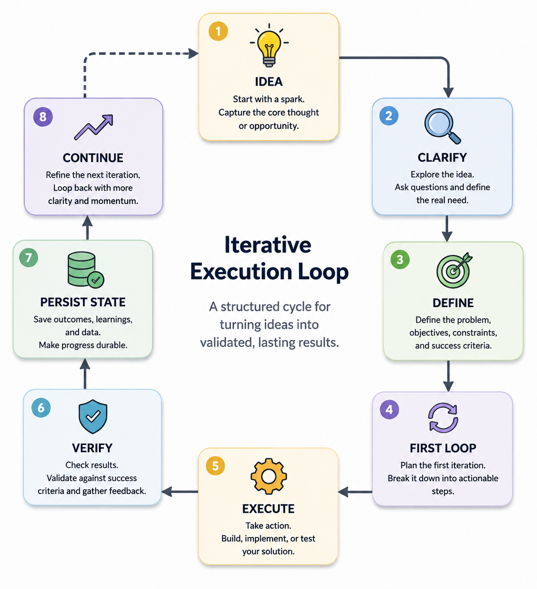

<div align="center">

# Loop Engineering Skill

**A workflow pack for turning vague ideas into bounded, verified project loops.**

[](LICENSE)
[](skills/loop-engineering/SKILL.md)
[](#quality-gates)
[](https://github.com/zq88577727/loop-engineering-skill/stargazers)

Use it as a Codex skill, or copy the Portable Prompt Pack into Cursor, Claude
Code, Gemini CLI, ChatGPT, and other AI coding tools.



</div>

## 30-second demo

Codex users can install the skill, restart Codex, then start a new project with
one rough idea:

```text
Use Loop Engineering for this vague idea: I want a small browser extension for saving useful snippets, but I do not know the exact requirements yet. Do not implement yet.
```

Expected result: Codex should clarify the idea, define a first loop, create or
propose `state/triage.md`, `state/decisions.md`, `state/inbox.md`, and
`state/next.md`, then stop before premature implementation. See the complete
walkthrough in [`docs/SHOWCASE.md`](docs/SHOWCASE.md).

Not using Codex? Open [`portable/README.md`](portable/README.md), copy the
Portable Prompt Pack, and use the same workflow in Cursor, Claude Code, Gemini
CLI, ChatGPT, or any assistant that can read project files.

## Use this when

- You have a vague idea and need Codex to turn it into a bounded first loop.
- You are continuing an existing project and want Codex to review state before
  deciding the next bounded loop.
- You want every iteration to end with explicit verification and durable state.

## Do not use this when

- The task is already tiny, deterministic, and ready for direct implementation.
- You only need a one-off answer with no future project state.
- You want a full project management framework instead of a lightweight Codex
  workflow guardrail.

## What This Is

Loop Engineering is a practical workflow pattern for Codex-assisted work:

```text
idea -> clarify -> define -> first loop -> execute -> verify -> persist state -> continue
```

This repository packages that pattern in two forms:

- A Codex skill for automatic discovery inside Codex.
- A Portable Prompt Pack for AI coding tools that do not load Codex skills.

It is designed for users who start with a rough project idea, a stalled build,
or a long-running task that needs structure before implementation.

## Why Use It

- Turns vague intent into a concrete first loop.
- Separates clarification, acceptance criteria, execution, and verification.
- Persists project state so future Codex sessions can resume from the same
  decision trail.
- Makes progress auditable through explicit PASS, REJECT, and CONTINUE gates.

## When To Use

Use this skill when the task is not yet ready for direct implementation:

- You have a product, tool, research, or automation idea but cannot give exact
  instructions yet.
- You need Codex to ask sharper questions before building.
- You want a reusable project state folder that survives across sessions.
- You want execution to be checked against acceptance criteria instead of judged
  by whether code was merely written.

## Install

Install from GitHub:

```bash
python3 ~/.codex/skills/.system/skill-installer/scripts/install-skill-from-github.py \
  --repo zq88577727/loop-engineering-skill \
  --ref v0.4.0 \
  --path skills/loop-engineering
```

Restart Codex after installation so the skill is discoverable.

Recommended stable baseline: `v0.4.0`. Omit `--ref v0.4.0` only when you
intentionally want the latest `main` branch version.

After restart, verify activation with a natural prompt:

```text
Use Loop Engineering for this vague idea: I want a small browser extension for saving useful snippets, but I do not know the exact requirements yet.
```

Codex should classify the request as a Loop Engineering task, clarify assumptions,
define the first loop, and create or propose state files before implementation.

## Quick Start

Natural trigger examples:

```text
Use Loop Engineering for this vague idea.
```

```text
按 Loop Engineering 继续这个项目，先读取 state 文件。
```

```text
帮我把这个模糊想法变成 first loop，不要马上实现。
```

## Portable Prompt Pack

Use this when you are not using Codex, or when your AI tool cannot install Codex
skills.

```text
portable/README.md
portable/LOOP_ENGINEERING_PROMPT.md
portable/LOOP_ENGINEERING_PROMPT.zh.md
portable/AGENTS_TEMPLATE.md
portable/STATE_TEMPLATE/
```

Basic path:

1. Copy `portable/LOOP_ENGINEERING_PROMPT.md` or
   `portable/LOOP_ENGINEERING_PROMPT.zh.md` into your AI coding tool.
2. Copy `portable/STATE_TEMPLATE/` into your project as `state/`.
3. Ask the assistant to continue through Project Outcome Gate, review
   `state/next.md` as a candidate next step, and execute only if it advances the
   user-visible demo and business acceptance.

This path is intended for Cursor, Claude Code, Gemini CLI, ChatGPT, JetBrains AI,
and similar tools. It is manual, but it does not require Codex.

## 中文快速开始

安装后重启 Codex。第一次进入新项目时，用这一句就够：

```text
用 Loop Engineering 初始化这个项目：先读当前文件，建立 state，拆出第一个可验证 loop，不要直接实现。
```

以后继续同一个项目，不需要每次背完整 prompt：

```text
用 Loop Engineering 继续这个项目。
```

Codex should first pass Project Outcome Gate, then decide whether to execute
`state/next.md`. The state file is a candidate next step, not the highest
instruction.

中文规则：先过 Project Outcome Gate，再决定是否执行 state/next.md。
Rule: state/next.md is a candidate next step, not the highest instruction.
Rule: review state/next.md against the user-visible demo and business acceptance
before execution.

如果上下文已经乱了，用这句重新对齐：

```text
用 Loop Engineering 重新对齐：先读 README、AGENTS 和 state，再复述当前 loop。
```

更多外部展示、安装复现和传播材料见：

- [`docs/SHOWCASE.md`](docs/SHOWCASE.md)
- [`docs/PROMOTION.md`](docs/PROMOTION.md)
- [`CONTRIBUTING.md`](CONTRIBUTING.md)

## Initialize A Project

After the skill is available in a workspace:

```bash
python3 ~/.codex/skills/loop-engineering/scripts/init_loop_project.py --target .
```

The initializer creates a lightweight project operating system:

```text
README.md
AGENTS.md
docs/acceptance.md
docs/architecture.md
state/triage.md
state/decisions.md
state/failures.md
state/inbox.md
state/next.md
```

Preview the files without writing:

```bash
python3 ~/.codex/skills/loop-engineering/scripts/init_loop_project.py --target . --dry-run
```

## Workflow Contract

Loop Engineering keeps Codex work inside a visible loop:

| Stage | Purpose | Output |
| --- | --- | --- |
| Idea | Capture the rough direction | Initial intent |
| Clarify | Ask only the questions that reduce real uncertainty | Better task boundary |
| Define | Set objective, constraints, and success criteria | Acceptance target |
| First Loop | Choose the smallest useful iteration | Executable plan |
| Execute | Build, research, write, or test | Concrete result |
| Verify | Compare result against the acceptance target | PASS or REJECT |
| Persist State | Save decisions, failures, and next actions | Durable context |
| Continue | Start the next loop from current evidence | Next iteration |

## Repository Layout

```text
.
|-- assets/
|   `-- loop-engineering-flow.png
|-- scripts/
|   `-- validate_repo.py
|-- docs/
|   |-- PROMOTION.md
|   `-- SHOWCASE.md
|-- portable/
|   |-- README.md
|   |-- LOOP_ENGINEERING_PROMPT.md
|   |-- LOOP_ENGINEERING_PROMPT.zh.md
|   |-- AGENTS_TEMPLATE.md
|   |-- STATE_TEMPLATE/
|   `-- examples/
|-- tests/
|   `-- test_repository_contract.py
|-- examples/
|   |-- vague-idea-to-first-loop/
|   |-- existing-project-continue/
|   `-- invalid-loop.md
`-- skills/
    `-- loop-engineering/
        |-- SKILL.md
        |-- agents/
        |   `-- openai.yaml
        |-- references/
        |   `-- full-workflow.md
        `-- scripts/
            `-- init_loop_project.py
```

## Quality Gates

The repository includes CI-compatible validation, unit tests, and a smoke-testable initializer:

```bash
python3 scripts/validate_repo.py
python3 -m unittest discover -s tests
python3 -m py_compile scripts/validate_repo.py skills/loop-engineering/scripts/init_loop_project.py
python3 evals/run_offline_eval.py
python3 skills/loop-engineering/scripts/init_loop_project.py --target /tmp/loop-engineering-smoke
```

Expected validation result:

```text
ok
```

For user-facing behavior examples, see:

- `examples/vague-idea-to-first-loop/`
- `examples/existing-project-continue/`
- `examples/forward-test-report.md`
- `examples/forward-test-existing-project.md`
- `examples/forward-test-premature-implementation.md`
- `examples/invalid-loop.md`

## Behavior Evals

The repository includes an automated behavior eval harness for the skill.

Run the deterministic offline eval without any token:

```bash
python3 evals/run_offline_eval.py
```

The offline eval covers three scenarios:

- vague idea -> clarify and scaffold state
- existing project -> continue one bounded loop from state
- premature implementation pressure -> reject coding too early and persist a
  next-loop plan

The latest offline report is stored in `evals/reports/offline-eval-report.md`.

Optional live model evals are available through the manual GitHub Actions
workflow `.github/workflows/live-eval.yml`, or locally with:

```bash
OPENAI_API_KEY=... python3 evals/run_live_eval.py --require-token
```

The live eval starts real `codex exec` sessions in temporary workspaces, checks
the state files those sessions write, applies scenario-level semantic contracts,
and remains outside default CI so public contributors can reproduce the default
quality gate without an API key.

Preview the Codex command shape without running a model:

```bash
python3 evals/run_live_eval.py --dry-run
```

Run one live scenario while debugging:

```bash
OPENAI_API_KEY=... python3 evals/run_live_eval.py --scenario premature-implementation --require-token
```

Run repeated samples across a small model matrix:

```bash
OPENAI_API_KEY=... python3 evals/run_live_eval.py --models default,gpt-5.5 --samples 3 --require-token
```

Failure samples are archived locally under `evals/reports/failures/*.json` with
the scenario, model, sample number, validator errors, workspace file list, and
required state-file snippets. These JSON files are ignored by git; the tracked
directory documents the reproducible failure-collection path.

## Design Principles

- **Bound the loop first.** Do not let vague intent become unbounded execution.
- **Verify before continuing.** Treat completion as evidence-based, not assumed.
- **Persist state deliberately.** Future sessions should inherit decisions,
  failures, and next actions without reconstructing context from memory.
- **Keep the workflow lightweight.** The skill provides structure, not a heavy
  project management system.

## License

MIT. See [LICENSE](LICENSE).
